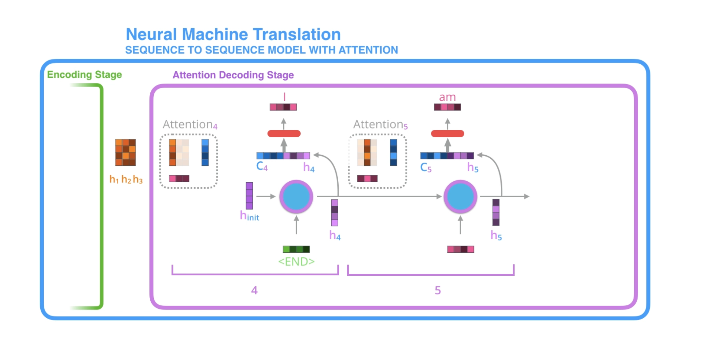
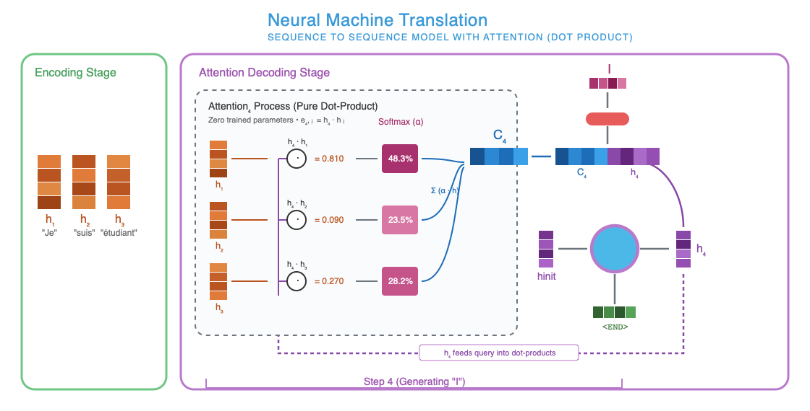

# Attention

## First proposed

[Neural Machine Translation by Jointly Learning to Align and Translate](https://arxiv.org/abs/1409.0473) in 2014 proposed soft-attention. Prior to this, all seq2seq models compressed the entire input into a fixed length "context" vector. This creates an information bottleneck, specially for long sentences.

### Soft vs. hard search?

Equivalent to soft attention vs hard attention.

Intuition:
- Hard Search/Attention: A sharp flashlight, pointed at a single word/token, totally ignoring all others. The models commits to only looking at that specific word/token. This is equivalent to looking up a word in the dictionary, there is no approximation, but we lookup the exact word.
- Soft Search/attention: A set of dimmer switches connected to every word/token. The model looks everywhere at the same time, and turn the brightness up on important words and dims the less important ones. Probably similar to how humans read a sentence, and we know which words are important given the context.


## Pre attention bottleneck

Taking standard seq2seq encoder-decoder model (RNN), for translation:

  1) Encoder processed each word in the input, one-by-one and genarating hidden state $h_t$ for each word. $h_t = \text{Encoder}(x_t, h_{t-1})$ shows that each hidden state is dependent on the current word being processed $x_t$ and the previous hidden state $h_{t-1}$.
  2) After the last input word is processed, the hidden state is passed into the decoder as a "context" vector of fixed length.
  3) The decoder is then initialized with this single vector $c$, which is the last hidden state from the encoder. And it generates words one by one: $s_i = \text{Decoder}(y_{i-1}, s_{i-1}, c)$. Where $c$ is the last hidden state from the encoder, $s_{i-1}$ is the previous hidden state, and $y_{i-1}$ is the previous generated word. So intuitively:
     - $y_{i-1}$: What was just said?
     - $s_{i-1}$: Thought process after saying $y_{i-1}$
     - $c$: Original input which was given

**Diagram to explain the above**
```text
Source: "The" -> "cat" -> "sat" -> "on" -> "the" -> "mat"
          |        |        |       |       |        |
         h_1      h_2      h_3     h_4     h_5      h_6 ───► [ Fixed Vector c ]
                                                                     │
                                    ┌────────────────────────────────┴────────────────────────┐
                                    ▼                                                         ▼
Target:                           "Le"                     "chat"               ...         "tapis"
```

**The Bottlenecks above:**
  1) Fixed capacity: $c$ is always of fixed length. Encoder is forced to compress all the information into single vector of fixed length.
  2) Vanishing memory: If encoder processes a long input, the important of the 1st word while processing 50th word will be significantly diluted.

But why don't we make the context vector very large? Then both the above bottlenecks might be solved?
  - Still vanishing memory: At each encoder step, encoder will process the long 10k vector. So for a long sentence, say 60 works, the vector has been processed 60 times. At that point, it is hard to find out the exact information/context for the initial words, after 60 gradient steps. Information get's diluted, scrambled at each step, 60 times.
  - O(1) vs. O(T). Significant compute requirements. Wasted resources for smaller inputs.
  - Needle in the haystack problem for decoder: How does decoder learn to process the 10k vector to understand what was the context while processing word 5?

So the problem is architecture of the way "context" is structured, not capacity of the context.

And attention passes a vector of vectors from encoder to decoder. So say for 10 words (1024 each), our attention matric would be 10240 numbers (~10k). However attention changes how that information is structured (information soup vs structured). And consumer of attention (decoder in our case) can decide what to use, when. This is where the soft-search (mentioned above) comes in.

## Attention explanation
  - Instead of one vector of fixed length, keep a vector of vectors $\{h_1, h_2, \dots, h_{T_x}\}$ which is given to decoder
  - At each step, decoder can soft-search, decide what is important and decoder.


Let's take an example of translating "Je suis étudiant" to "I am a student". Suppose the hidden representation size is $d=2$. Intuitively each dimention in $d$ would represent some concept which the model learns:

<figure style="width: 100%; margin: 0;">
  
  <figcaption align="center"><i>Decoder-attention NN example from Jay Alammar's blog</i></figcaption>
</figure>

<br><br>


$$
\begin{aligned}
% ====================================================================
% STAGE 1: ENCODING STAGE
% ====================================================================
&\underline{\textbf{STAGE 1: ENCODING STAGE (Source Sentence: "Je suis étudiant")}} \\
&\text{The Bidirectional Encoder outputs an annotation vector for each source word (dim } d=2\text{):} \\
&\quad h_1 = \begin{bmatrix} 0.90 \\ 0.10 \end{bmatrix} \text{ ("Je" — Subject)} \quad\quad
      h_2 = \begin{bmatrix} 0.10 \\ 0.90 \end{bmatrix} \text{ ("suis" — Verb)} \quad\quad
      h_3 = \begin{bmatrix} 0.30 \\ 0.20 \end{bmatrix} \text{ ("étudiant" — Noun)} \\[1.5em]

% ====================================================================
% STAGE 2: INITIALIZATION & STEP 4 DECODER
% ====================================================================
&\underline{\textbf{STAGE 2: INITIALIZATION \& STEP 4 DECODER CELL}} \\
&\text{1. The decoder's initial hidden state is computed from the encoder (purple vector):} \\
&\quad h_{\text{init}} = \begin{bmatrix} 0.70 \\ 0.10 \end{bmatrix} \\[0.6em]
&\text{2. The first decoder cell takes } h_{\text{init}} \text{ and } \text{<END>} \text{ token to produce decoder state } h_4 \text{ (purple vector):} \\
&\quad h_4 = \text{RNN}_{\text{dec}}(h_{\text{init}}, \text{<END>}) = \begin{bmatrix} 0.90 \\ 0.00 \end{bmatrix} \quad \\[1.5em]

% ====================================================================
% STAGE 3: ATTENTION_4 MECHANISM
% ====================================================================
&\underline{\textbf{STAGE 3: THE ATTENTION BOX (Attention}_4\textbf{)}} \\
&\text{Learned params: } W_a = \begin{bmatrix} 1 & 0 \\ 0 & 1 \end{bmatrix}, \quad U_a = \begin{bmatrix} 1 & 0 \\ 0 & 1 \end{bmatrix}, \quad v_a = \begin{bmatrix} 2.0 \\ -1.0 \end{bmatrix} \\[0.8em]
&\textbf{(A) Compute Energy Scores } e_{4,j} = v_a^T \tanh(W_a h_4 + U_a h_j): \\[0.4em]
&\quad \bullet\ \text{For word 1 ("Je"):} \\
&\quad\quad W_a h_4 + U_a h_1 = \begin{bmatrix} 0.90 \\ 0.00 \end{bmatrix} + \begin{bmatrix} 0.90 \\ 0.10 \end{bmatrix} = \begin{bmatrix} 1.80 \\ 0.10 \end{bmatrix} \\
&\quad\quad \tanh\left(\begin{bmatrix} 1.80 \\ 0.10 \end{bmatrix}\right) \approx \begin{bmatrix} 0.947 \\ 0.100 \end{bmatrix} \\
&\quad\quad e_{4,1} = \begin{bmatrix} 2.0 & -1.0 \end{bmatrix} \begin{bmatrix} 0.947 \\ 0.100 \end{bmatrix} = 2.0(0.947) - 1.0(0.100) = \mathbf{1.794} \\[0.6em]
&\quad \bullet\ \text{For word 2 ("suis"):} \\
&\quad\quad W_a h_4 + U_a h_2 = \begin{bmatrix} 0.90 \\ 0.00 \end{bmatrix} + \begin{bmatrix} 0.10 \\ 0.90 \end{bmatrix} = \begin{bmatrix} 1.00 \\ 0.90 \end{bmatrix} \\
&\quad\quad \tanh\left(\begin{bmatrix} 1.00 \\ 0.90 \end{bmatrix}\right) \approx \begin{bmatrix} 0.762 \\ 0.716 \end{bmatrix} \\
&\quad\quad e_{4,2} = \begin{bmatrix} 2.0 & -1.0 \end{bmatrix} \begin{bmatrix} 0.762 \\ 0.716 \end{bmatrix} = 2.0(0.762) - 1.0(0.716) = \mathbf{0.808} \\[0.6em]
&\quad \bullet\ \text{For word 3 ("étudiant"):} \\
&\quad\quad W_a h_4 + U_a h_3 = \begin{bmatrix} 0.90 \\ 0.00 \end{bmatrix} + \begin{bmatrix} 0.30 \\ 0.20 \end{bmatrix} = \begin{bmatrix} 1.20 \\ 0.20 \end{bmatrix} \\
&\quad\quad \tanh\left(\begin{bmatrix} 1.20 \\ 0.20 \end{bmatrix}\right) \approx \begin{bmatrix} 0.834 \\ 0.197 \end{bmatrix} \\
&\quad\quad e_{4,3} = \begin{bmatrix} 2.0 & -1.0 \end{bmatrix} \begin{bmatrix} 0.834 \\ 0.197 \end{bmatrix} = 2.0(0.834) - 1.0(0.197) = \mathbf{1.471} \\[0.8em]

&\textbf{(B) Softmax Normalization (Small pink bar in attention): } \alpha_{4,j} = \frac{\exp(e_{4,j})}{\sum_{k=1}^3 \exp(e_{4,k})} \\[0.4em]
&\quad \exp(e_{4,1}) = \exp(1.794) \approx 6.013 \\
&\quad \exp(e_{4,2}) = \exp(0.808) \approx 2.243 \\
&\quad \exp(e_{4,3}) = \exp(1.471) \approx 4.354 \\
&\quad \text{Denominator Sum} = 6.013 + 2.243 + 4.354 = 12.610 \\[0.6em]
&\quad \alpha_{4,1} = \frac{6.013}{12.610} \approx \mathbf{0.477} \quad (\textbf{47.7\% attention to "Je"} \rightarrow \text{Dark column in diagram}) \\
&\quad \alpha_{4,2} = \frac{2.243}{12.610} \approx \mathbf{0.178} \quad (\textbf{17.8\% attention to "suis"} \rightarrow \text{Faded column in diagram}) \\
&\quad \alpha_{4,3} = \frac{4.354}{12.610} \approx \mathbf{0.345} \quad (\textbf{34.5\% attention to "étudiant"} \rightarrow \text{Medium column in diagram}) \\[1.5em]

% ====================================================================
% STAGE 4: CONTEXT VECTOR C_4 & PREDICTION
% ====================================================================
&\underline{\textbf{STAGE 4: COMPUTING CONTEXT VECTOR } c_4 \textbf{ AND EMITTING "I"}} \\[0.4em]
&\text{1. Weighted sum of encoder vectors produces Context Vector } c_4 \text{ (blue vector):} \\
&\quad c_4 = \sum_{j=1}^3 \alpha_{4,j} h_j = 0.477 \begin{bmatrix} 0.90 \\ 0.10 \end{bmatrix} + 0.178 \begin{bmatrix} 0.10 \\ 0.90 \end{bmatrix} + 0.345 \begin{bmatrix} 0.30 \\ 0.20 \end{bmatrix} \\
&\quad c_4 = \begin{bmatrix} 0.4293 \\ 0.0477 \end{bmatrix} + \begin{bmatrix} 0.0178 \\ 0.1602 \end{bmatrix} + \begin{bmatrix} 0.1035 \\ 0.0690 \end{bmatrix} = \mathbf{\begin{bmatrix} 0.551 \\ 0.277 \end{bmatrix}} \\[0.8em]
&\text{2. Concatenate context vector } c_4 \text{ and decoder state } h_4 \text{ (side-by-side blue and purple vector):} \\
&\quad [c_4 \,;\, h_4] = \begin{bmatrix} 0.551 \\ 0.277 \\ 0.900 \\ 0.000 \end{bmatrix} \\[0.8em]
&\text{3. Feed through output layer (orange capsule) to predict the target word:} \\
&\quad \hat{y}_4 = \text{Softmax}\left( W_o [c_4 \,;\, h_4] \right) \implies P(\text{"I"}) = \mathbf{0.94} \implies \mathbf{\text{Output: "I"}}
\end{aligned}
$$

## Attention evolution

The initial attention proposed was feed-forward attention, which is a learned neural network, as shown in the diagram above $e_{4,j} = v_a^T \tanh(W_a h_4 + U_a h_j)$. This works, but there is a bottleneck, it is slow. To compute energy for sentence of 50 words, we matrix multiply, add, $tanh$ and dot product 50 times. So decoding is really slow.

In 2015, Luong et al. optimized this. Their hypothesis was why do we need to learn a neural network, dot product can give us the same information.

### Intuition of dot product

A dot product of two vectors measure how well they align: $A \cdot B = \|A\| \|B\| \cos(\theta)$
  - max positive score if they align
  - 0 if they are perpendicular
  - min negative score if they are opposite

In pure dot-product attention, there are NO extra attention parameters to train at all. The model simply trains the encoder and decoder so that words with matching concepts naturally align in vector space. As long as they are the same dimensions. This is where `GPU` comes in!

```
1. BAHADANAU (2014) - Additive / Feedforward (Slow, Many Weights):
   h_4 ──► [ W_a ] ──┐
                     ├──► (+) ──► [ tanh ] ──► [ v_a^T ] ──► Score e_4,j
   h_j ──► [ U_a ] ──┘
   (Requires 3 sets of trained weights: W_a, U_a, v_a)


2. LUONG (2015) - Dot-Product (Blazing Fast, 0 Extra Weights):
   h_4 ──┐
         ├──► [ Dot Product: h_4 · h_j ] ──────────────────► Score e_4,j
   h_j ──┘
   (No weights! Just vector multiplication. GPUs do this in 1 clock cycle.)
```

<figure style="width: 100%; margin: 0;">
  
  <figcaption align="center"><i>Decoder-attention dot product example</i></figcaption>
</figure>

<br><br>

Now the mathematical represenation:
$$
\begin{aligned}
% ====================================================================
% STAGE 1: ENCODING STAGE
% ====================================================================
&\underline{\textbf{STAGE 1: ENCODING STAGE (Orange blocks on the left: } h_1, h_2, h_3\textbf{)}} \\
&\text{The encoder processes "Je suis étudiant" and outputs three annotation vectors (dim } d=2\text{):} \\
&\quad h_1 = \begin{bmatrix} 0.90 \\ 0.10 \end{bmatrix} \text{ ("Je" — Subject)}, \quad
      h_2 = \begin{bmatrix} 0.10 \\ 0.90 \end{bmatrix} \text{ ("suis" — Verb)}, \quad
      h_3 = \begin{bmatrix} 0.30 \\ 0.20 \end{bmatrix} \text{ ("étudiant" — Noun)} \\[1.5em]

% ====================================================================
% STAGE 2: DECODER CELL (STEP 4)
% ====================================================================
&\underline{\textbf{STAGE 2: DECODER CELL INPUT \& STATE } h_4\textbf{ (Purple vector)}} \\
&\text{1. The initial hidden state } h_{\text{init}} \text{ (purple) and } \text{<END>} \text{ token (green) enter the decoder circle:} \\
&\quad h_4 = \text{RNN}_{\text{dec}}(h_{\text{init}}, \text{<END>}) = \begin{bmatrix} 0.90 \\ 0.00 \end{bmatrix} \quad (\text{"Looking for a Subject to start sentence"}) \\[1.5em]

% ====================================================================
% STAGE 3: ATTENTION_4 PROCESS BOX
% ====================================================================
&\underline{\textbf{STAGE 3: THE } \text{Attention}_4\text{ Process BOX (Dotted outline in diagram)}} \\
&\text{Notice: No feedforward weights } (W_a, U_a, v_a) \text{ exist! Only pure dot-products at the } \odot \text{ nodes:} \\[0.8em]

&\textbf{(A) Direct Dot Products at the } \odot \text{ connection nodes } (h_4 \cdot h_j): \\[0.4em]
&\quad \bullet\ \text{Node } (h_4 \cdot h_1) \text{ for "Je":} \\
&\quad\quad e_{4,1} = h_4^T h_1 = \begin{bmatrix} 0.90 & 0.00 \end{bmatrix} \begin{bmatrix} 0.90 \\ 0.10 \end{bmatrix} = (0.90 \times 0.90) + (0.00 \times 0.10) = \mathbf{0.810} \\[0.5em]
&\quad \bullet\ \text{Node } (h_4 \cdot h_2) \text{ for "suis":} \\
&\quad\quad e_{4,2} = h_4^T h_2 = \begin{bmatrix} 0.90 & 0.00 \end{bmatrix} \begin{bmatrix} 0.10 \\ 0.90 \end{bmatrix} = (0.90 \times 0.10) + (0.00 \times 0.90) = \mathbf{0.090} \\[0.5em]
&\quad \bullet\ \text{Node } (h_4 \cdot h_3) \text{ for "étudiant":} \\
&\quad\quad e_{4,3} = h_4^T h_3 = \begin{bmatrix} 0.90 & 0.00 \end{bmatrix} \begin{bmatrix} 0.30 \\ 0.20 \end{bmatrix} = (0.90 \times 0.30) + (0.00 \times 0.20) = \mathbf{0.270} \\[0.8em]

&\textbf{(B) Softmax Normalization (The vertical ping boxes labeled "Softmax"): } \alpha_{4,j} = \frac{\exp(e_{4,j})}{\sum_{k=1}^3 \exp(e_{4,k})} \\[0.4em]
&\quad \exp(e_{4,1}) = \exp(0.810) \approx 2.248 \\
&\quad \exp(e_{4,2}) = \exp(0.090) \approx 1.094 \\
&\quad \exp(e_{4,3}) = \exp(0.270) \approx 1.310 \\
&\quad \text{Denominator Sum} = 2.248 + 1.094 + 1.310 = 4.652 \\[0.6em]
&\quad \alpha_{4,1} = \frac{2.248}{4.652} \approx \mathbf{0.483} \quad (\textbf{48.3\% attention to "Je"} \rightarrow \text{Top cell in Softmax column}) \\
&\quad \alpha_{4,2} = \frac{1.094}{4.652} \approx \mathbf{0.235} \quad (\textbf{23.5\% attention to "suis"} \rightarrow \text{Middle cell in Softmax column}) \\
&\quad \alpha_{4,3} = \frac{1.310}{4.652} \approx \mathbf{0.282} \quad (\textbf{28.2\% attention to "étudiant"} \rightarrow \text{Bottom cell in Softmax column}) \\[1.5em]

% ====================================================================
% STAGE 4: CONTEXT VECTOR C_4 AND CONCATENATION
% ====================================================================
&\underline{\textbf{STAGE 4: COMPUTING } C_4 \textbf{ (Blue block) \& PREDICTING "I" (Pink block)}} \\[0.4em]
&\text{1. Weighted sum at the } \times \text{ nodes produces Context Vector } C_4 \text{ (the blue horizontal block):} \\
&\quad C_4 = \sum_{j=1}^3 \alpha_{4,j} h_j = 0.483 \begin{bmatrix} 0.90 \\ 0.10 \end{bmatrix} + 0.235 \begin{bmatrix} 0.10 \\ 0.90 \end{bmatrix} + 0.282 \begin{bmatrix} 0.30 \\ 0.20 \end{bmatrix} \\
&\quad C_4 = \begin{bmatrix} 0.4347 \\ 0.0483 \end{bmatrix} + \begin{bmatrix} 0.0235 \\ 0.2115 \end{bmatrix} + \begin{bmatrix} 0.0846 \\ 0.0564 \end{bmatrix} = \mathbf{\begin{bmatrix} 0.543 \\ 0.316 \end{bmatrix}} \\[1.0em]

&\text{2. Concatenate context vector } C_4 \text{ and decoder state } h_4 \text{ (side-by-side blue and purple bar):} \\
&\quad [C_4 \,;\, h_4] = \begin{bmatrix} 0.543 \\ 0.316 \\ 0.900 \\ 0.000 \end{bmatrix} \\[1.0em]

&\text{3. Project to vocabulary logits to emit the target word (pink/magenta blocks at top):} \\
&\quad \hat{y}_4 = \text{Softmax}\left( W_o [C_4 \,;\, h_4] \right) \implies P(\text{"I"}) = \mathbf{0.95} \implies \mathbf{\text{Output: "I"}}
\end{aligned}
$$

So here we can see, the improvement is in the "soft-search" scoring. First, we do not need to learn and additional neural network. Second, while infering a dot-product (on GPU) is blazing fast.

The softmax part remains the same.

## Global vs. local attention

Luong's 2015 paper had two proposed attention mechanisms:

```
GLOBAL ATTENTION (All words)
Decoder queries: ────► [ h_1,  h_2,  h_3,  h_4,  h_5,  ...  h_100 ] (Looks at EVERYTHING)

LOCAL ATTENTION (Focused window)
Decoder queries: ──────────────► [ h_14, h_15, h_16, h_17, h_18 ] (Looks only at window around p_t)
                                        ▲
                                   Center p_t
```

The above explanation is for global attention. WHich means for every single word generated, we look at all $\{h_1, h_2, ... ,h_n\}$. This is compute intensive, but model never misses anything in theory.

Local attention has a small window, say $D=2$. Model first predicts an `aligned position` in the source sentence, whic roughly corresponds to where the generation word is. Which means to generate 10th word, we would only look at $\{h_8, h_9, h_10, h_11, h_12\}$.

However, gloabal attention won because modern GPUs are very efficient in matric multiplcation. And this penalty was not big enough.

## Cross attention vs. self attention

  - Cross attention is what we saw above. The attention vector come from encoder, but generation happens in decoder (consumer of attention). This is normally when we have different modalities of data. Like translation models, diffusion models, speech to text etc.
  - Self attention is when attention consumer or the attention producer. This is almost always decoder only models like modern LLMs. There is no modality tranformation, just next token prediction given the current tokens. Multi-modal LLMs would fall here too, assuming all modalities map into same token space.

## Assumptions

### Length of vectors

In our math shown above, we chose the vector length $d=2$. This makes it easy to show dot products. While the same length was $d=4$ in the diagrams. This is just for show. In reality it would be the model's architectural param, often called `hidden_dim` or `hidden_size` or `d_model`.

 - Bahdanau (2014) paper had $d=1000$
 - Transformer paper (2017) had $d=512$
 - GPT-2 varied from 768 to 1600 based on model size

 `d` decides many things like model expressive power, compute and memory requirements, training data requirements, overfitting/underfitting tendencies, dot product stability etc, just like other model params.

## References
 - [Neural Machine Translation by Jointly Learning to Align and Translate](https://arxiv.org/abs/1409.0473) - Attention proposal paper
 - [Effective Approaches to Attention-based Neural Machine Translation](https://arxiv.org/abs/1508.04025) - Refined Bahdanau's attention mechanism. The diagram above is based on this, easier to understand.
 - [Visualizing A Neural Machine Translation Model - Jay Alammar](https://jalammar.github.io/visualizing-neural-machine-translation-mechanics-of-seq2seq-models-with-attention/) - for visualization of attention in RNN seq2seq models