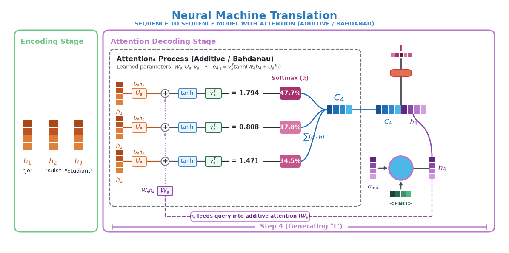

# Attention

## First proposed

[Neural Machine Translation by Jointly Learning to Align and Translate](https://arxiv.org/abs/1409.0473) in 2014 proposed soft-attention. Prior to this, all seq2seq models compressed the entire input into a fixed length "context" vector. This creates an information bottleneck, specially for long sentences.

### Soft vs. hard search?

Equivalent to soft attention vs hard attention.

Intuition:
- Hard Search/Attention: A sharp flashlight, pointed at a single word/token, totally ignoring all others. The models commits to only looking at that specific word/token. This is equivalent to looking up a word in the dictionary, there is no approximation, but we lookup the exact word.
- Soft Search/attention: A set of dimmer switches connected to every word/token. The model looks everywhere at the same time, and turn the brightness up on important words and dims the less important ones. Probably similar to how humans read a sentence, and we know which words are important given the context.


## Pre attention bottleneck

Taking standard seq2seq encoder-decoder model (RNN), for translation:

  1) Encoder processed each word in the input, one-by-one and generating hidden state $h_t$ for each word. $h_t = \text{Encoder}(x_t, h_{t-1})$ shows that each hidden state is dependent on the current word being processed $x_t$ and the previous hidden state $h_{t-1}$.
  2) After the last input word is processed, the hidden state is passed into the decoder as a "context" vector of fixed length.
  3) The decoder is then initialized with this single vector $c$, which is the last hidden state from the encoder. And it generates words one by one: $s_i = \text{Decoder}(y_{i-1}, s_{i-1}, c)$. Where $c$ is the last hidden state from the encoder, $s_{i-1}$ is the previous hidden state, and $y_{i-1}$ is the previous generated word. So intuitively:
     - $y_{i-1}$: What was just said?
     - $s_{i-1}$: Thought process after saying $y_{i-1}$
     - $c$: Original input which was given

**Diagram to explain the above**
```text
Source: "The" -> "cat" -> "sat" -> "on" -> "the" -> "mat"
          |        |        |       |       |        |
         h_1      h_2      h_3     h_4     h_5      h_6 ───► [ Fixed Vector c ]
                                                                     │
                                    ┌────────────────────────────────┴────────────────────────┐
                                    ▼                                                         ▼
Target:                           "Le"                     "chat"               ...         "tapis"
```

**The Bottlenecks above:**
  1) Fixed capacity: $c$ is always of fixed length. Encoder is forced to compress all the information into single vector of fixed length.
  2) Vanishing memory: If encoder processes a long input, the important of the 1st word while processing 50th word will be significantly diluted.

But why don't we make the context vector very large? Then both the above bottlenecks might be solved?
  - Still vanishing memory: At each encoder step, encoder will process the long 10k vector. So for a long sentence, say 60 words, the vector has been processed 60 times. At that point, it is hard to find out the exact information/context for the initial words, after 60 recurrent processing steps. Information gets diluted, scrambled at each step, 60 times.
  - O(1) vs. O(T). Significant compute requirements. Wasted resources for smaller inputs.
  - Needle in the haystack problem for decoder: How does decoder learn to process the 10k vector to understand what was the context while processing word 5?

So the problem is architecture of the way "context" is structured, not capacity of the context.

And attention passes a vector of vectors from encoder to decoder. So say for 10 words (1024 each), our attention matrix would be 10240 numbers (~10k). However attention changes how that information is structured (information soup vs structured). And consumer of attention (decoder in our case) can decide what to use, when. This is where the soft-search (mentioned above) comes in.

## Attention explanation
  - Instead of one vector of fixed length, keep a vector of vectors $\{h_1, h_2, \dots, h_{T_x}\}$ which is given to decoder
  - At each step, decoder can soft-search, decide what is important and decoder.


Let's take an example of translating "Je suis étudiant" to "I am a student". Suppose the hidden representation size is $d=2$. Intuitively each dimension in $d$ would represent some concept which the model learns:

<figure style="width: 100%; margin: 0;">
  
  <figcaption align="left"><i>Decoder-attention NN example from Jay Alammar's blog</i></figcaption>
</figure>

<br><br>

<figure style="width: 100%; margin: 0;">
  
  <figcaption align="left"><i>Decoder-attention detailed</i></figcaption>
</figure>

<br><br>

### Stage 1: Encoding Stage (Source Sentence: "Je suis étudiant")
The Bidirectional Encoder outputs an annotation vector for each source word ($d=2$):

$$
h_1 = \begin{bmatrix} 0.90 \\ 0.10 \end{bmatrix} \text{ ("Je" — Subject)}, \quad
h_2 = \begin{bmatrix} 0.10 \\ 0.90 \end{bmatrix} \text{ ("suis" — Verb)}, \quad
h_3 = \begin{bmatrix} 0.30 \\ 0.20 \end{bmatrix} \text{ ("étudiant" — Noun)}
$$

### Stage 2: Initialization & Step 4 Decoder Cell
1. The decoder's initial hidden state is computed from the encoder (purple vector):

$$
h_{\text{init}} = \begin{bmatrix} 0.70 \\ 0.10 \end{bmatrix}
$$

2. The first decoder cell takes $h_{\text{init}}$ and `<END>` token to produce decoder state $h_4$ (purple vector):

$$
h_4 = \text{RNN}_{\text{dec}}(h_{\text{init}}, \text{<END>}) = \begin{bmatrix} 0.90 \\ 0.00 \end{bmatrix}
$$

### Stage 3: The Attention Box ($\text{Attention}_4$)
**Learned parameters:**

$$
W_a = \begin{bmatrix} 1 & 0 \\ 0 & 1 \end{bmatrix}, \quad U_a = \begin{bmatrix} 1 & 0 \\ 0 & 1 \end{bmatrix}, \quad v_a = \begin{bmatrix} 2.0 \\ -1.0 \end{bmatrix}
$$

**(A) Compute query & key equivalent projections:**

1. The decoder query projection $W_a h_4$ (computed once and broadcast to each word via the purple query bus):

$$
W_a h_4 = \begin{bmatrix} 1 & 0 \\ 0 & 1 \end{bmatrix} \begin{bmatrix} 0.90 \\ 0.00 \end{bmatrix} = \begin{bmatrix} 0.90 \\ 0.00 \end{bmatrix}
$$

2. Compute Key Projections $U_a h_j$, sum with $W_a h_4$, apply $\tanh$, and project with $v_a^T$:

**For word 1 ("Je"):**

$$
\begin{aligned}
U_a h_1 &= \begin{bmatrix} 1 & 0 \\ 0 & 1 \end{bmatrix} \begin{bmatrix} 0.90 \\ 0.10 \end{bmatrix} = \begin{bmatrix} 0.90 \\ 0.10 \end{bmatrix} \\
W_a h_4 + U_a h_1 &= \begin{bmatrix} 0.90 \\ 0.00 \end{bmatrix} + \begin{bmatrix} 0.90 \\ 0.10 \end{bmatrix} = \begin{bmatrix} 1.80 \\ 0.10 \end{bmatrix} \\
\tanh\left(\begin{bmatrix} 1.80 \\ 0.10 \end{bmatrix}\right) &\approx \begin{bmatrix} 0.947 \\ 0.100 \end{bmatrix} \\
e_{4,1} &= v_a^T \tanh(W_a h_4 + U_a h_1) = \begin{bmatrix} 2.0 & -1.0 \end{bmatrix} \begin{bmatrix} 0.947 \\ 0.100 \end{bmatrix} = 2.0(0.947) - 1.0(0.100) = \mathbf{1.794}
\end{aligned}
$$

**For word 2 ("suis"):**

$$
\begin{aligned}
U_a h_2 &= \begin{bmatrix} 1 & 0 \\ 0 & 1 \end{bmatrix} \begin{bmatrix} 0.10 \\ 0.90 \end{bmatrix} = \begin{bmatrix} 0.10 \\ 0.90 \end{bmatrix} \\
W_a h_4 + U_a h_2 &= \begin{bmatrix} 0.90 \\ 0.00 \end{bmatrix} + \begin{bmatrix} 0.10 \\ 0.90 \end{bmatrix} = \begin{bmatrix} 1.00 \\ 0.90 \end{bmatrix} \\
\tanh\left(\begin{bmatrix} 1.00 \\ 0.90 \end{bmatrix}\right) &\approx \begin{bmatrix} 0.762 \\ 0.716 \end{bmatrix} \\
e_{4,2} &= v_a^T \tanh(W_a h_4 + U_a h_2) = \begin{bmatrix} 2.0 & -1.0 \end{bmatrix} \begin{bmatrix} 0.762 \\ 0.716 \end{bmatrix} = 2.0(0.762) - 1.0(0.716) = \mathbf{0.808}
\end{aligned}
$$

**For word 3 ("étudiant"):**

$$
\begin{aligned}
U_a h_3 &= \begin{bmatrix} 1 & 0 \\ 0 & 1 \end{bmatrix} \begin{bmatrix} 0.30 \\ 0.20 \end{bmatrix} = \begin{bmatrix} 0.30 \\ 0.20 \end{bmatrix} \\
W_a h_4 + U_a h_3 &= \begin{bmatrix} 0.90 \\ 0.00 \end{bmatrix} + \begin{bmatrix} 0.30 \\ 0.20 \end{bmatrix} = \begin{bmatrix} 1.20 \\ 0.20 \end{bmatrix} \\
\tanh\left(\begin{bmatrix} 1.20 \\ 0.20 \end{bmatrix}\right) &\approx \begin{bmatrix} 0.834 \\ 0.197 \end{bmatrix} \\
e_{4,3} &= v_a^T \tanh(W_a h_4 + U_a h_3) = \begin{bmatrix} 2.0 & -1.0 \end{bmatrix} \begin{bmatrix} 0.834 \\ 0.197 \end{bmatrix} = 2.0(0.834) - 1.0(0.197) = \mathbf{1.471}
\end{aligned}
$$

**(B) Softmax Normalization (Small pink bar in attention):**

$$
\alpha_{4,j} = \frac{\exp(e_{4,j})}{\sum_{k=1}^3 \exp(e_{4,k})}
$$

$$
\begin{aligned}
\exp(e_{4,1}) &= \exp(1.794) \approx 6.013 \\
\exp(e_{4,2}) &= \exp(0.808) \approx 2.243 \\
\exp(e_{4,3}) &= \exp(1.471) \approx 4.354 \\
\text{Denominator Sum} &= 6.013 + 2.243 + 4.354 = 12.610
\end{aligned}
$$

$$
\begin{aligned}
\alpha_{4,1} &= \frac{6.013}{12.610} \approx \mathbf{0.477} \quad (\textbf{47.7\% attention to "Je"} \rightarrow \text{Dark column in diagram}) \\
\alpha_{4,2} &= \frac{2.243}{12.610} \approx \mathbf{0.178} \quad (\textbf{17.8\% attention to "suis"} \rightarrow \text{Faded column in diagram}) \\
\alpha_{4,3} &= \frac{4.354}{12.610} \approx \mathbf{0.345} \quad (\textbf{34.5\% attention to "étudiant"} \rightarrow \text{Medium column in diagram})
\end{aligned}
$$

### Stage 4: Computing Context Vector $c_4$ & Prediction
1. Weighted sum of encoder vectors produces Context Vector $c_4$ (blue vector):

$$
c_4 = \sum_{j=1}^3 \alpha_{4,j} h_j = 0.477 \begin{bmatrix} 0.90 \\ 0.10 \end{bmatrix} + 0.178 \begin{bmatrix} 0.10 \\ 0.90 \end{bmatrix} + 0.345 \begin{bmatrix} 0.30 \\ 0.20 \end{bmatrix} = \mathbf{\begin{bmatrix} 0.551 \\ 0.277 \end{bmatrix}}
$$

2. Concatenate context vector $c_4$ and decoder state $h_4$ (side-by-side blue and purple vector):

$$
[c_4 \,;\, h_4] = \begin{bmatrix} 0.551 \\ 0.277 \\ 0.900 \\ 0.000 \end{bmatrix}
$$

3. Feed through output layer (orange capsule) to predict the target word:

$$
\hat{y}_4 = \text{Softmax}\left( W_o [c_4 \,;\, h_4] \right) \implies P(\text{"I"}) = \mathbf{0.94} \implies \mathbf{\text{Output: "I"}}
$$

## Attention evolution

The initial attention proposed was feed-forward attention, which is a learned neural network, as shown in the diagram above $e_{4,j} = v_a^T \tanh(W_a h_4 + U_a h_j)$. This works, but there is a bottleneck, it is slow. To compute energy for sentence of 50 words, we matrix multiply, add, $tanh$ and dot product 50 times. So decoding is really slow.

In 2015, Luong et al. optimized this. Their hypothesis was why do we need to learn a neural network, dot product can give us the same information.

### Intuition of dot product

A dot product of two vectors measure how well they align: $A \cdot B = \|A\| \|B\| \cos(\theta)$
  - max positive score if they align
  - 0 if they are perpendicular
  - min negative score if they are opposite


In pure dot-product attention, there is no extra parameter to train for attention scoring itself, the model simply relies on encoder and decoder states aligning directly in vector space. The model simply trains the encoder and decoder so that words with matching concepts naturally align in vector space. As long as they are the same dimensions. This is where `GPU` comes in!

```
1. BAHDANAU (2014) - Additive / Feedforward (Slow, Many Weights):
   h_4 ──► [ W_a ] ──┐
                     ├──► (+) ──► [ tanh ] ──► [ v_a^T ] ──► Score e_4,j
   h_j ──► [ U_a ] ──┘
   (Requires 3 sets of trained weights: W_a, U_a, v_a)


2. LUONG (2015) - Dot-Product (Blazing Fast, 0 Extra Weights):
   h_4 ──┐
         ├──► [ Dot Product: h_4 · h_j ] ──────────────────► Score e_4,j
   h_j ──┘
   (Zero weights for scoring! Relies on vector similarity; highly parallelizable on GPUs.)
```

<figure style="width: 100%; margin: 0;">
  
  <figcaption align="center"><i>Decoder-attention dot product example</i></figcaption>
</figure>

### Stage 1: Encoding Stage (Orange blocks on the left: $h_1, h_2, h_3$)
The encoder processes "Je suis étudiant" and outputs three annotation vectors ($d=2$):

$$
h_1 = \begin{bmatrix} 0.90 \\ 0.10 \end{bmatrix} \text{ ("Je" — Subject)}, \quad
h_2 = \begin{bmatrix} 0.10 \\ 0.90 \end{bmatrix} \text{ ("suis" — Verb)}, \quad
h_3 = \begin{bmatrix} 0.30 \\ 0.20 \end{bmatrix} \text{ ("étudiant" — Noun)}
$$

### Stage 2: Decoder Cell (Step 4) Input & State $h_4$ (Purple vector)
1. The initial hidden state $h_{\text{init}}$ (purple) and `<END>` token (green) enter the decoder circle:

$$
h_4 = \text{RNN}_{\text{dec}}(h_{\text{init}}, \text{<END>}) = \begin{bmatrix} 0.90 \\ 0.00 \end{bmatrix} \quad (\text{"Looking for a Subject to start sentence"})
$$

### Stage 3: The $\text{Attention}_4\text{ Process}$ Box (Dotted outline in diagram)
Notice: No feedforward weights ($W_a, U_a, v_a$) exist! Only pure dot-products at the $\odot$ nodes.

**(A) Direct Dot Products at the $\odot$ connection nodes ($e_{4,j} = h_4 \cdot h_j$):**

**Node $(h_4 \cdot h_1)$ for "Je":**

$$
e_{4,1} = h_4^T h_1 = \begin{bmatrix} 0.90 & 0.00 \end{bmatrix} \begin{bmatrix} 0.90 \\ 0.10 \end{bmatrix} = (0.90 \times 0.90) + (0.00 \times 0.10) = \mathbf{0.810}
$$

**Node $(h_4 \cdot h_2)$ for "suis":**

$$
e_{4,2} = h_4^T h_2 = \begin{bmatrix} 0.90 & 0.00 \end{bmatrix} \begin{bmatrix} 0.10 \\ 0.90 \end{bmatrix} = (0.90 \times 0.10) + (0.00 \times 0.90) = \mathbf{0.090}
$$

**Node $(h_4 \cdot h_3)$ for "étudiant":**

$$
e_{4,3} = h_4^T h_3 = \begin{bmatrix} 0.90 & 0.00 \end{bmatrix} \begin{bmatrix} 0.30 \\ 0.20 \end{bmatrix} = (0.90 \times 0.30) + (0.00 \times 0.20) = \mathbf{0.270}
$$

**(B) Softmax Normalization (The vertical pink boxes labeled "Softmax"):**

$$
\alpha_{4,j} = \frac{\exp(e_{4,j})}{\sum_{k=1}^3 \exp(e_{4,k})}
$$

$$
\begin{aligned}
\exp(e_{4,1}) &= \exp(0.810) \approx 2.248 \\
\exp(e_{4,2}) &= \exp(0.090) \approx 1.094 \\
\exp(e_{4,3}) &= \exp(0.270) \approx 1.310 \\
\text{Denominator Sum} &= 2.248 + 1.094 + 1.310 = 4.652
\end{aligned}
$$

$$
\begin{aligned}
\alpha_{4,1} &= \frac{2.248}{4.652} \approx \mathbf{0.483} \quad (\textbf{48.3\% attention to "Je"} \rightarrow \text{Top cell in Softmax column}) \\
\alpha_{4,2} &= \frac{1.094}{4.652} \approx \mathbf{0.235} \quad (\textbf{23.5\% attention to "suis"} \rightarrow \text{Middle cell in Softmax column}) \\
\alpha_{4,3} &= \frac{1.310}{4.652} \approx \mathbf{0.282} \quad (\textbf{28.2\% attention to "étudiant"} \rightarrow \text{Bottom cell in Softmax column})
\end{aligned}
$$

### Stage 4: Computing $C_4$ (Blue block) & Predicting "I" (Pink block)
1. Weighted sum at the $\times$ nodes produces Context Vector $C_4$ (the blue horizontal block):

$$
C_4 = \sum_{j=1}^3 \alpha_{4,j} h_j = 0.483 \begin{bmatrix} 0.90 \\ 0.10 \end{bmatrix} + 0.235 \begin{bmatrix} 0.10 \\ 0.90 \end{bmatrix} + 0.282 \begin{bmatrix} 0.30 \\ 0.20 \end{bmatrix} = \mathbf{\begin{bmatrix} 0.543 \\ 0.316 \end{bmatrix}}
$$

2. Concatenate context vector $C_4$ and decoder state $h_4$ (side-by-side blue and purple bar):

$$
[C_4 \,;\, h_4] = \begin{bmatrix} 0.543 \\ 0.316 \\ 0.900 \\ 0.000 \end{bmatrix}
$$

3. Project to vocabulary logits to emit the target word (pink/magenta blocks at top):

$$
\hat{y}_4 = \text{Softmax}\left( W_o [C_4 \,;\, h_4] \right) \implies P(\text{"I"}) = \mathbf{0.95} \implies \mathbf{\text{Output: "I"}}
$$

So here we can see, the improvement is in the "soft-search" scoring. First, we do not need to learn an additional neural network. Second, while inferring a dot-product (on GPU) is blazing fast.

The softmax part remains the same.

## Global vs. local attention

Luong's 2015 paper had two proposed attention mechanisms:

```
GLOBAL ATTENTION (All words)
Decoder queries: ────► [ h_1,  h_2,  h_3,  h_4,  h_5,  ...  h_100 ] (Looks at EVERYTHING)

LOCAL ATTENTION (Focused window)
Decoder queries: ──────────────► [ h_14, h_15, h_16, h_17, h_18 ] (Looks only at window around p_t)
                                        ▲
                                   Center p_t
```

The above explanation is for global attention. Which means for every single word generated, we look at all $\{h_1, h_2, ... ,h_n\}$. This is compute intensive, but model never misses anything in theory.

Local attention has a small window, say $D=2$. Model first predicts an `aligned position` in the source sentence, which roughly corresponds to where the generation word is. Which means to generate 10th word, we would only look at $\{h_8, h_9, h_{10}, h_{11}, h_{12}\}$.

However, global attention won because modern GPUs are very efficient in matrix multiplication. And this penalty was not big enough.

## Cross attention vs. self attention

  - Cross attention is what we saw above. The attention vectors come from encoder, but generation happens in decoder (consumer of attention). This is normally when we have different modalities/dimensions of data. Like translation models, diffusion models, speech to text etc.
  - Self attention is when attention consumer is the same as attention producer. Example: decoder only models like modern LLMs, encoder only models like BERT, or encoder only block in an encoder-decoder model. There is no modality/dimension transformation. Multi-modal LLMs would fall here too, assuming all modalities map into same token space.

## Assumptions

### Length of vectors

In our math shown above, we chose the vector length $d=2$. This makes it easy to show dot products. While the same length was $d=4$ in the diagrams. This is just for show. In reality it would be the model's architectural param, often called `hidden_dim` or `hidden_size` or `d_model`.

 - Bahdanau (2014) paper had $d=1000$
 - Transformer paper (2017) had $d=512$
 - GPT-2 varied from 768 to 1600 based on model size

 `d` decides many things like model expressive power, compute and memory requirements, training data requirements, overfitting/underfitting tendencies, dot product stability etc, just like other model params.

 ### END token

 The example is unusual because decoder starts with the `<END>` token, and picked up from the reference blog and used for simplicity. Normally models are fed a `<start>` or `<bos>` (beginning of sentence) token to trigger decoding. 


 ### Attention/decoding order

 The original 2014 paper has attention step before decoding. So the flow was: `Previous State → [Attention Mechanism] → Context Vector → [RNN Cell] → Current State → Predict Word`.

 The 2015 paper changed it to: `Previous State → [RNN Cell] → Current State → [Attention Mechanism]→ Context Vector → Predict Word`.

 Again, I continued with the 2015 paper's order since that is in the blog and I picked up that diagram in my notes. So essentially the two diagrams are using 2015 paper's order, but comparing the math between 2014 and 2015 paper, for simplicity.

## References
 - [Neural Machine Translation by Jointly Learning to Align and Translate](https://arxiv.org/abs/1409.0473) - Attention proposal paper
 - [Effective Approaches to Attention-based Neural Machine Translation](https://arxiv.org/abs/1508.04025) - Refined Bahdanau's attention mechanism. The diagram above is based on this, easier to understand.
 - [Visualizing A Neural Machine Translation Model - Jay Alammar](https://jalammar.github.io/visualizing-neural-machine-translation-mechanics-of-seq2seq-models-with-attention/) - for visualization of attention in RNN seq2seq models