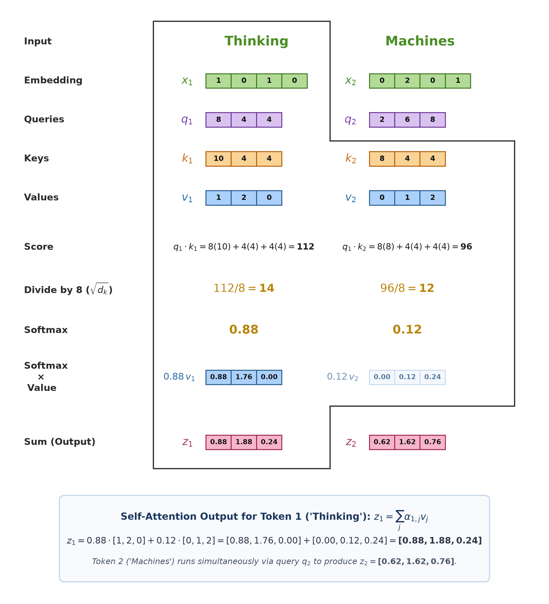
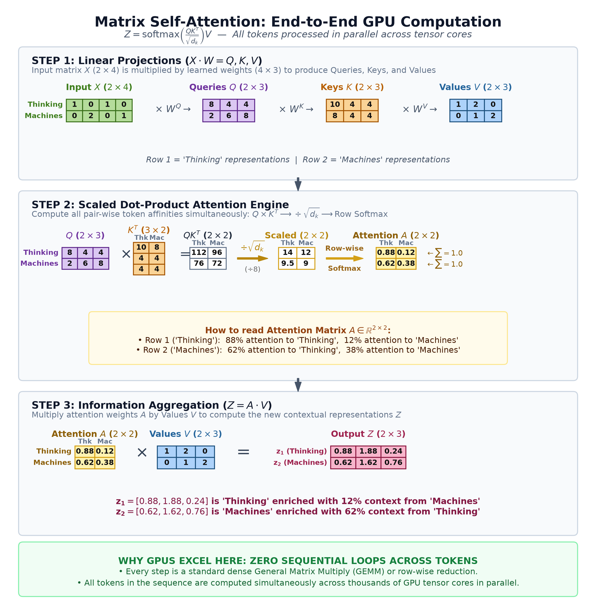
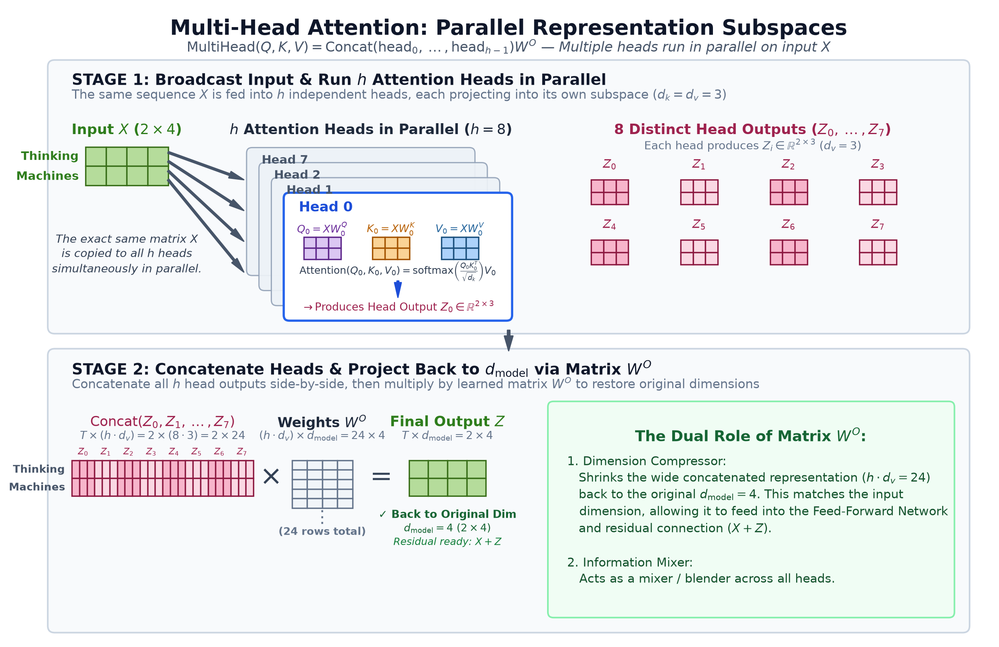
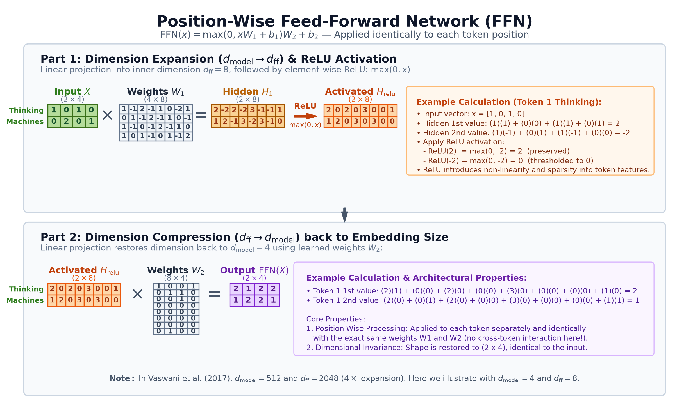
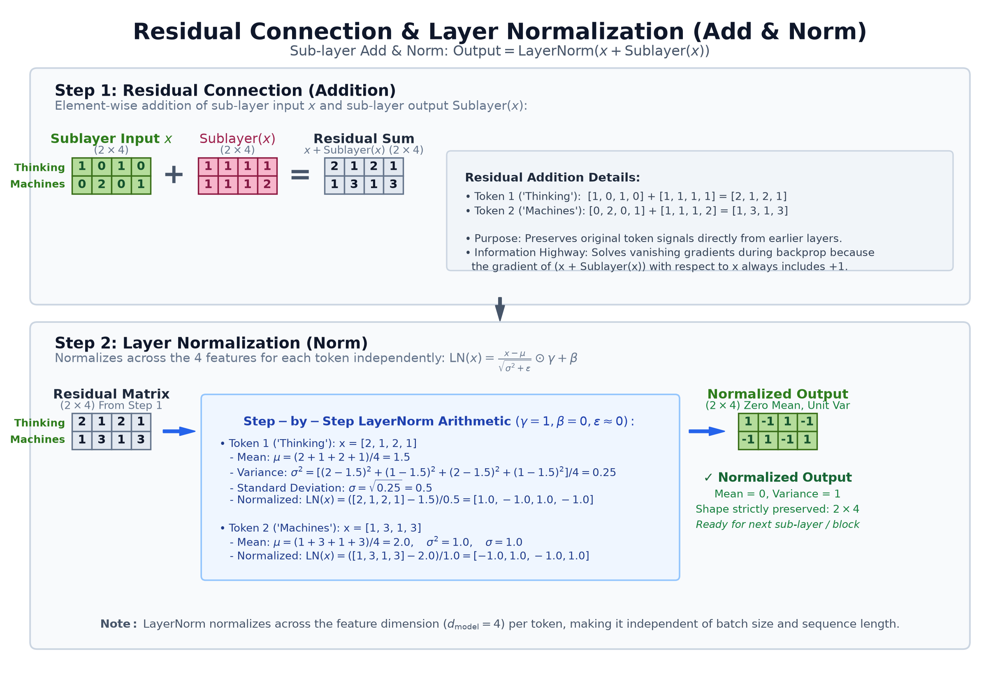
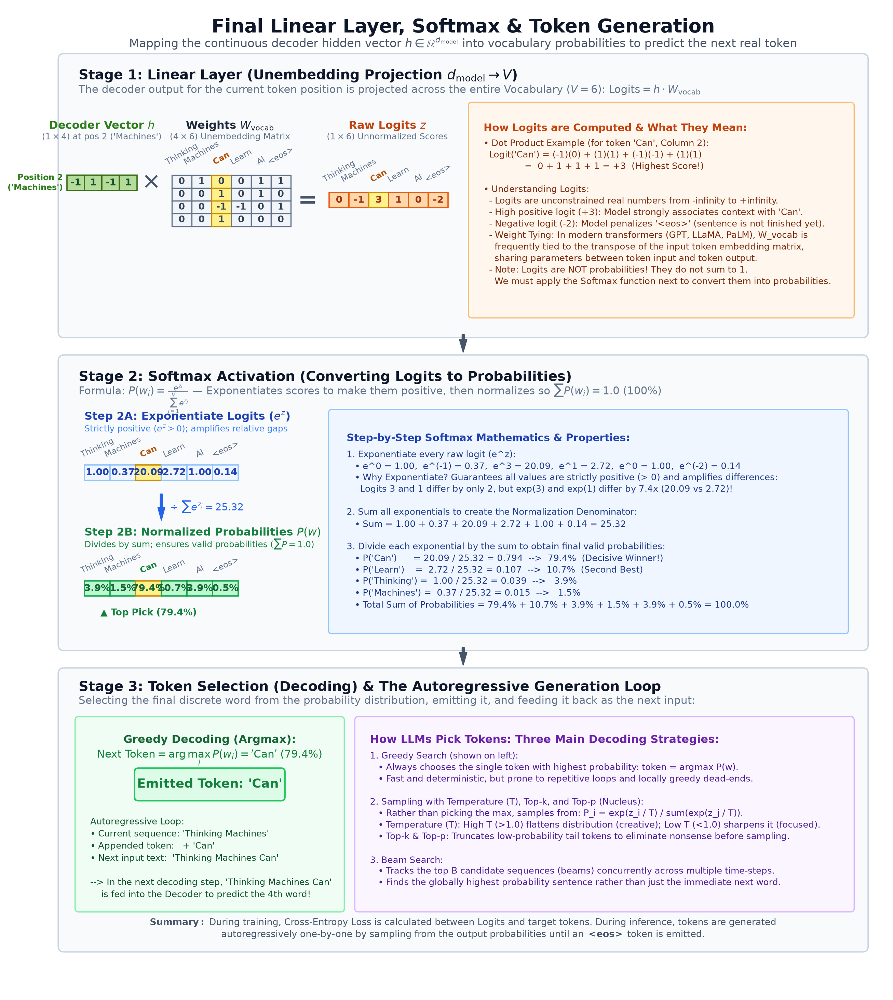

# Transformer (original paper)

- Before the transformers paper in 2017, sequence modeling was mainly RNNs, LSTMs etc. Often with attention, which was proposed in 2014.
- They required processing each token at a time. And token $T_n$ cannot be processed until $T_{n-1}$ is processed. So the time complexity is $\mathcal{O}(N)$. This could be very expensive with longer inputs. And both training and inference are difficult to scale.
- Transformers discarded recurrence and convolutions, and relied solely on attention to draw dependencies between tokens, inputs and outputs.
- Modern GPUs can help here, processing math operations in parallel.
- Additionally, attentions helps long distance communications. Token 1 can talk to token N in $\mathcal{O}(1)$. In seq2seq model, this is hard (see attentions.md)
- However we can argue the transformer also has $N$ layers, which are sequential. But these don't depend on input length and that cost is fixed. So once we have a big enough compute ability, then the cost is fixed.

## Intuition

- RNN / Seq2Seq is like the Chinese Whispers:
    - Token 1 reads its input and whispers a summary state to token 2.
    - Token 2 combines its own meaning with what it heard and whispers to token 3.
    - By the time token 50 is reached, the initial message is inevitably distorted, compressed, or diluted. Even if a decoder has attention, the encoder representations were built through this sequential whisper chain.
- Transformer is a multi-round conference:
    - Round 1/layer 1: All tokens sit at a round conference table at the exact same moment, laying their initial notes on the table
    - Everyone looks around the room, reads everyone else's notes, assesses who is relevant to them (attention scores), and takes notes (weighted sum of values)
    - Between rounds, each token privately reflects on what it heard, synthesizing the new context with its prior knowledge (feedforward and residuals)
    - Then they meet again, repeat.

### Complexity comparison

| Architecture | Sequential Operations | Max Path Length | Memory / Compute per Layer |
| :--- | :--- | :--- | :--- |
| **Recurrent (RNN/LSTM)** | $O(N)$ | $O(N)$ | $O(N \cdot d^2)$ |
| **Self-Attention (Transformer)** | $\mathbf{O(1)}$ | $\mathbf{O(1)}$ | $O(N^2 \cdot d)$ |

(Where N is sequence length, d is representation dimension, and k is convolution kernel size).

## Attention in transformer

Transformer used scaled dot product attention.

$$
\text{Attention}(Q, K, V) = \text{softmax}\left(\frac{Q K^T}{\sqrt{d_k}}\right) V
$$

<figure style="width: 100%; margin: 0;">
  
</figure>

Now, if we use matrix multiplication on a GPU/NPU/TPU, we can do all of the above for all tokens in one go, shown below, where we assume we only have 2 tokens to process.

<figure style="width: 100%; margin: 0;">
  
</figure>

- Above we see self-attention. Where $K$, $Q$, $V$, all come from the same inputs. This was used in encoders.
- Decoders used two attention block:
    - First, self attention but masked. So here a token can only look back, not forward. This forces the auto-regressive nature. In above example, token for "thinking" will not be able to attend to token for "machines" (~infinity), but the other way works. So a token can only attend backwards.
    - Second, cross attention, which is similar to self attention but the $Q$ is from decoder's inputs, while the $K$ and $V$ is from encoder's last layer output.

## Multi-head attention

The transformer paper proposed multi-head attention, which means there are parallel attention heads running on the same input. The resultant matrices are concatenated and then multiplied by a learned matrix to convert back to its original dimension.

<figure style="width: 100%; margin: 0;">
  
</figure>

  

## Feedforward

Then finally each encoder and decoder block has a feedforward layer shown below. The transformer paper proposed 6 blocks of encoder and 6 blocks of decoder (empirical choice).

The FFN consists of two linear transformations with a ReLU activation in between:

$$\mathrm{FFN}(x) = \max(0, x W_1 + b_1) W_2 + b_2$$
1. **Expansion ($d_{\text{model}} \rightarrow d_{\text{ff}}$)**: Projects the $2 \times 4$ token matrix into an expanded $2 \times 8$ hidden space using $W_1 \in \mathbb{R}^{4 \times 8}$.
2. **Non-linear thresholding ($\text{ReLU}$)**: Applies $\max(0, x)$ element-wise, zeroing out negative values and keeping positive features.
3. **Compression ($d_{\text{ff}} \rightarrow d_{\text{model}}$)**: Projects back from $2 \times 8$ to the original $2 \times 4$ embedding dimension using $W_2 \in \mathbb{R}^{8 \times 4}$.

<figure style="width: 100%; margin: 0;">
  
</figure>
  

## Residual (addition and normalization)

Another important thing to note is that the transformer worked on residuals. Which means after each layer (attention, feedforward), the final matrix was simply added to the input. This concept was taken from earlier papers like ResNet.

The intuition here is that each layer becomes an expert of something, and adds info, and it does not need to create the information from scratch. So the transformer acts as an information highway.

$$\text{Output} = \mathrm{LayerNorm}(x + \mathrm{Sublayer}(x))$$
1. **Addition ($x + \text{Sublayer}(x)$)**: Element-wise sum of the sub-layer input and output. Acts as an information highway that solves vanishing gradients during backprop.
2. **Layer Normalization ($\text{LN}$)**: Normalizes across the feature dimension ($d_{\text{model}} = 4$) independently for each token position:
   $$\mathrm{LN}(x) = \frac{x - \mu}{\sqrt{\sigma^2 + \epsilon}} \odot \gamma + \beta$$
   - Unlike BatchNorm, LayerNorm does not depend on other tokens in the sequence or on batch size.
   - Forces each token vector to have zero mean ($\mu = 0$) and unit variance ($\sigma^2 = 1$).
<figure style="width: 100%; margin: 0;">
  
</figure>
  

Solves vanishing gradients: During training (back-propagation) if the errors are too small, the gradients would become extremely small (~0). Hence keeping the residual ($x+F(x)$) ensure that errors propagating backward are enough for early layers to receive significant values, in order to learn.

$$\frac{d}{dx}(x) = 1$$

Hence because of residuals, we will always add +1.

 It’s not necessarily that the initial error is small, even if the final error is large, repeatedly multiplying derivatives across many deep layers (0.2×0.2×0.2…) causes the gradient to shrink to near zero (∼0) before it ever reaches early layers.

## Linear + Softmax

Now we convert the matrix into the final output. Note that we only use a single vector from the produced matrix, which is the vector representing the last token "machines".

<figure style="width: 100%; margin: 0;">
  
</figure>

**Stage 1**: Create raw logits
  - Take the normalized vector for "machines" and multiply by the unembedding matrix $W$, across the models full vocabulary (6 in the above diagram).
  - This basically generates raw logits, which is the likelihood of the next token.

**Stage 2**: Softmax
  - Exponentiate and normalize each value. So they are all positive and sum to 1.

**Stage 3**: Token selection
  - Multiple ways to pick the next token (greedy search, beam search etc.)

Beam search: Explore $B$ (beam width) possible candidates at each step. Original transformer proposed $B=4$. At each step, the lowest probability candidates are dropped, and only the top $B$ are kept and we proceed. This sometimes helps the model explore interesting possibilities.

## Other assumptions
- Positional encodings: The original transformer also *added* a positional encodings to the initial input before starting to process them. This helps the model understand the location of each token with respect to others.
  - This is important because self attention is invariant to positions. Softmax would treat token 1 and token 10 exactly the same. "The dog bit the man" and "The man bit the dog" produce the exact same attention outputs.
- Original transformer was proposed for translation task.
- In the dot product attention, we divide by $\sqrt{d_k}$ to prevent vanishing gradients.
  - When we feed huge values into softmax, the output is nearly 1.
  - For such cases, derivative is almost 0. 
  - Dividing scales the variance back to 1, keeping softmax values in the sensitive range.

## References

 - [Attention is all you need](https://arxiv.org/abs/1706.03762)
 - [Jal Alammar's blog](https://jalammar.github.io/illustrated-transformer/)